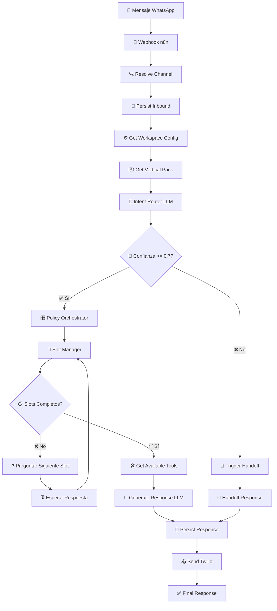
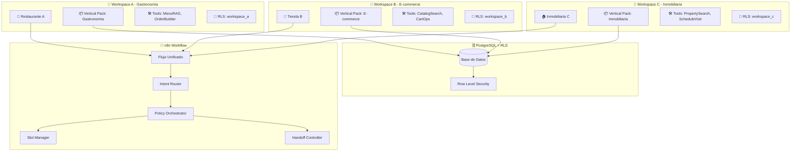
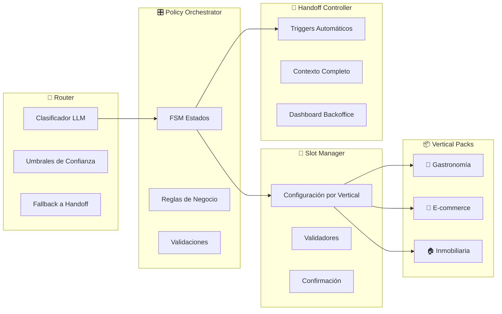
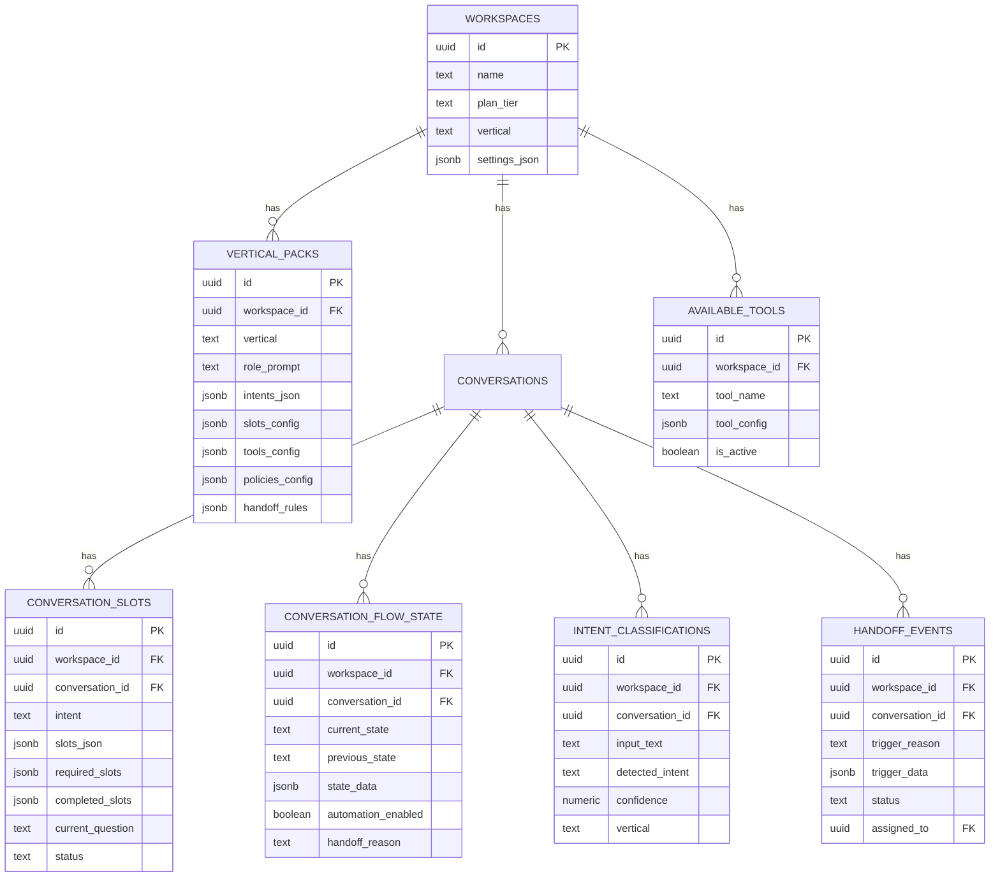
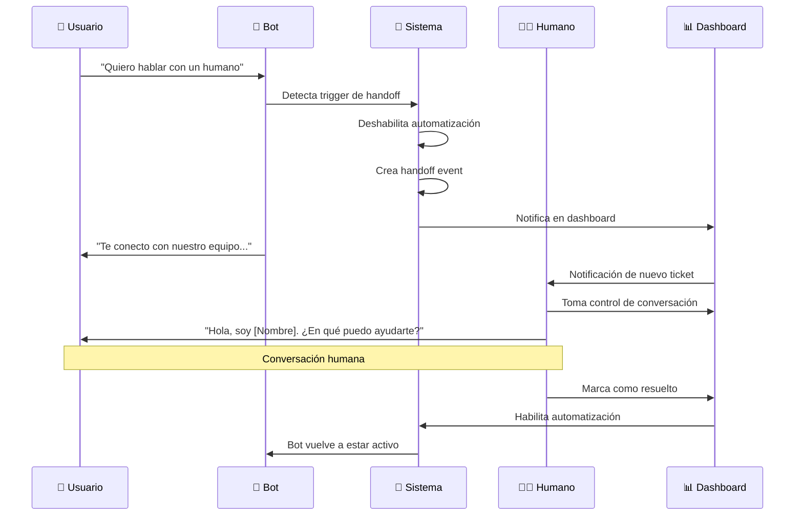
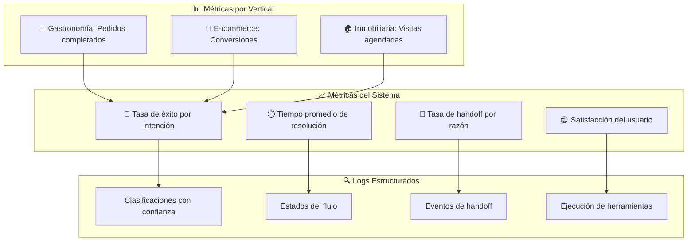

# 🏗️ Diagrama de Arquitectura PulpoAI v2.0

## Flujo Principal de Conversación

## Arquitectura Multi-Tenant

## Componentes del Sistema

## Base de Datos - Nuevas Tablas

## Flujo de Handoff Humano

## Métricas y Observabilidad

---

**Versión**: 2.0  
**Fecha**: Enero 2025  
**Formato**: Mermaid Diagrams
