# 🏗️ Diagrama de Arquitectura PulpoAI v2.0

## Flujo Principal de Conversación

```mermaid
graph TD
    A[📱 Mensaje WhatsApp] --> B[🔗 Webhook n8n]
    B --> C[🔍 Resolve Channel]
    C --> D[💾 Persist Inbound]
    D --> E[⚙️ Get Workspace Config]
    E --> F[📦 Get Vertical Pack]
    F --> G[🧠 Intent Router LLM]
    
    G --> H{🎯 Confianza >= 0.7?}
    H -->|❌ No| I[🚨 Trigger Handoff]
    H -->|✅ Sí| J[🎛️ Policy Orchestrator]
    
    J --> K[📝 Slot Manager]
    K --> L{📋 Slots Completos?}
    L -->|❌ No| M[❓ Preguntar Siguiente Slot]
    M --> N[⏳ Esperar Respuesta]
    N --> K
    L -->|✅ Sí| O[🛠️ Get Available Tools]
    
    O --> P[🤖 Generate Response LLM]
    P --> Q[💾 Persist Response]
    Q --> R[📤 Send Twilio]
    R --> S[✅ Final Response]
    
    I --> T[👤 Handoff Response]
    T --> Q
```

## Arquitectura Multi-Tenant

```mermaid
graph TB
    subgraph "🏢 Workspace A - Gastronomía"
        WA1[🍕 Restaurante A]
        WA2[📦 Vertical Pack: Gastronomía]
        WA3[🛠️ Tools: MenuRAG, OrderBuilder]
        WA4[💾 RLS: workspace_a]
    end
    
    subgraph "🏢 Workspace B - E-commerce"
        WB1[🛒 Tienda B]
        WB2[📦 Vertical Pack: E-commerce]
        WB3[🛠️ Tools: CatalogSearch, CartOps]
        WB4[💾 RLS: workspace_b]
    end
    
    subgraph "🏢 Workspace C - Inmobiliaria"
        WC1[🏠 Inmobiliaria C]
        WC2[📦 Vertical Pack: Inmobiliaria]
        WC3[🛠️ Tools: PropertySearch, ScheduleVisit]
        WC4[💾 RLS: workspace_c]
    end
    
    subgraph "🗄️ PostgreSQL + RLS"
        DB[(Base de Datos)]
        RLS[Row Level Security]
    end
    
    subgraph "🧠 n8n Workflow"
        WF[Flujo Unificado]
        ROUTER[Intent Router]
        ORCH[Policy Orchestrator]
        SLOTS[Slot Manager]
        HANDOFF[Handoff Controller]
    end
    
    WA1 --> WF
    WB1 --> WF
    WC1 --> WF
    
    WF --> ROUTER
    ROUTER --> ORCH
    ORCH --> SLOTS
    ORCH --> HANDOFF
    
    WA2 --> DB
    WB2 --> DB
    WC2 --> DB
    
    DB --> RLS
```

## Componentes del Sistema

```mermaid
graph LR
    subgraph "🎯 Router"
        R1[Clasificador LLM]
        R2[Umbrales de Confianza]
        R3[Fallback a Handoff]
    end
    
    subgraph "🎛️ Policy Orchestrator"
        P1[FSM Estados]
        P2[Reglas de Negocio]
        P3[Validaciones]
    end
    
    subgraph "📝 Slot Manager"
        S1[Configuración por Vertical]
        S2[Validadores]
        S3[Confirmación]
    end
    
    subgraph "🚨 Handoff Controller"
        H1[Triggers Automáticos]
        H2[Contexto Completo]
        H3[Dashboard Backoffice]
    end
    
    subgraph "📦 Vertical Packs"
        V1[🍕 Gastronomía]
        V2[🛒 E-commerce]
        V3[🏠 Inmobiliaria]
    end
    
    R1 --> P1
    P1 --> S1
    P1 --> H1
    S1 --> V1
    S1 --> V2
    S1 --> V3
```

## Base de Datos - Nuevas Tablas

## Flujo de Handoff Humano

## Métricas y Observabilidad

```mermaid
graph TB
    subgraph "📊 Métricas por Vertical"
        M1[🍕 Gastronomía: Pedidos completados]
        M2[🛒 E-commerce: Conversiones]
        M3[🏠 Inmobiliaria: Visitas agendadas]
    end
    
    subgraph "📈 Métricas del Sistema"
        S1[🎯 Tasa de éxito por intención]
        S2[⏱️ Tiempo promedio de resolución]
        S3[🚨 Tasa de handoff por razón]
        S4[😊 Satisfacción del usuario]
    end
    
    subgraph "🔍 Logs Estructurados"
        L1[Clasificaciones con confianza]
        L2[Estados del flujo]
        L3[Eventos de handoff]
        L4[Ejecución de herramientas]
    end
    
    M1 --> S1
    M2 --> S1
    M3 --> S1
    
    S1 --> L1
    S2 --> L2
    S3 --> L3
    S4 --> L4
```

---

**Versión**: 2.0  
**Fecha**: Enero 2025  
**Formato**: Mermaid Diagrams
