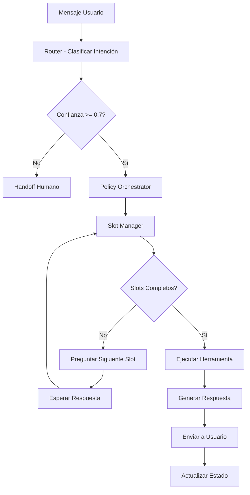

# 🏗️ Arquitectura Mejorada PulpoAI - Multi-Tenant Multi-Vertical

## 📋 Resumen Ejecutivo

Esta documentación describe la nueva arquitectura de PulpoAI implementada siguiendo las mejores prácticas propuestas por ChatGPT. La arquitectura implementa un sistema multi-tenant con soporte para múltiples verticales (gastronomía, e-commerce, inmobiliaria) usando un flujo unificado con router inteligente, policy orchestrator y handoff humano.

## 🎯 Objetivos de la Nueva Arquitectura

1. **Multi-tenancy**: Aislamiento completo por workspace con RLS
2. **Multi-vertical**: Soporte para diferentes industrias con configuraciones específicas
3. **Router inteligente**: Clasificación automática de intenciones por vertical
4. **Slot filling**: Recolección estructurada de información del usuario
5. **Handoff humano**: Escalamiento inteligente cuando es necesario
6. **Escalabilidad**: Arquitectura preparada para crecimiento

## 🏛️ Componentes de la Arquitectura

### 1. **Router (Clasificador de Intenciones)**
- **Función**: Determina la vertical y intención del mensaje del usuario
- **Implementación**: LLM con prompt específico por vertical
- **Salidas**: `{intent, confidence, vertical, requires_handoff}`
- **Umbrales**: Confianza < 0.7 → handoff automático

### 2. **Policy Orchestrator (Orquestador de Políticas)**
- **Función**: Gestiona el flujo de conversación usando FSM + LLM
- **Estados**: `start → processing → slot_collecting → tool_execution → completed`
- **Reglas**: Políticas de negocio, horarios, límites de monto
- **Fallbacks**: Handoff automático en casos específicos

### 3. **Slot Manager (Gestor de Slots)**
- **Función**: Recolección estructurada de información requerida
- **Configuración**: Por vertical e intención
- **Validación**: Validadores específicos por tipo de dato
- **Confirmación**: Confirmación automática antes de procesar

### 4. **Vertical Packs (Paquetes por Vertical)**
- **Gastronomía**: Menú, pedidos, delivery, reservas
- **E-commerce**: Catálogo, carrito, checkout, seguimiento
- **Inmobiliaria**: Propiedades, visitas, calificación de leads

### 5. **Handoff Controller (Controlador de Escalamiento)**
- **Triggers**: Confianza baja, solicitud explícita, monto alto, palabras clave
- **Experiencia**: Transferencia suave con contexto completo
- **Backoffice**: Dashboard para gestión de tickets

## 📊 Base de Datos - Nuevas Tablas

### `pulpo.vertical_packs`
Configuración completa por vertical:
```sql
- role_prompt: Personalidad del asistente
- intents_json: Intenciones disponibles con sinónimos
- slots_config: Configuración de slots por intención
- tools_config: Herramientas disponibles
- policies_config: Políticas de negocio
- handoff_rules: Reglas de escalamiento
```

### `pulpo.conversation_slots`
Estado de slots por conversación:
```sql
- intent: Intención actual
- slots_json: Valores recolectados
- required_slots: Slots obligatorios
- completed_slots: Slots completados
- current_question: Pregunta actual
- status: collecting|completed|failed|handoff
```

### `pulpo.conversation_flow_state`
Estado del flujo de conversación:
```sql
- current_state: Estado actual del FSM
- previous_state: Estado anterior
- state_data: Datos del estado
- automation_enabled: Si la automatización está activa
- handoff_reason: Razón del handoff si aplica
```

### `pulpo.available_tools`
Herramientas disponibles por workspace:
```sql
- tool_name: Nombre de la herramienta
- tool_config: Configuración específica
- is_active: Si está habilitada
```

### `pulpo.intent_classifications`
Registro de clasificaciones:
```sql
- input_text: Texto original
- detected_intent: Intención detectada
- confidence: Nivel de confianza
- vertical: Vertical detectada
```

### `pulpo.handoff_events`
Eventos de escalamiento:
```sql
- trigger_reason: Razón del handoff
- trigger_data: Datos del trigger
- status: triggered|acknowledged|resolved
- assigned_to: Usuario asignado
```

## 🔄 Flujo de Conversación



## 🛠️ Herramientas por Vertical

### Gastronomía
- **MenuRAG**: Búsqueda en menú con RAG
- **OrderBuilder**: Construcción de pedidos
- **PaymentLink**: Generación de links de pago
- **DeliveryETA**: Cálculo de tiempo de entrega

### E-commerce
- **CatalogSearch**: Búsqueda en catálogo
- **CartOps**: Operaciones de carrito
- **OrderTracker**: Seguimiento de pedidos
- **ShippingETA**: Cálculo de envíos

### Inmobiliaria
- **PropertySearch**: Búsqueda de propiedades
- **ScheduleVisit**: Agendamiento de visitas
- **LeadQualify**: Calificación de leads

## 🎛️ Configuración de Vertical Packs

### Ejemplo: Gastronomía
```yaml
vertical: gastronomia
role_prompt: >
  Sos un asistente del restaurante X. Sé cordial, directo y orientado a cerrar pedidos...
intents:
  - take_order
  - menu_question
  - hours_location
slots:
  take_order:
    required: [product, quantity, pickup_or_delivery, name, phone]
    validators:
      product: menu_item_exists
      quantity: int>0
    confirm: true
tools:
  - MenuRAG.search
  - OrderBuilder.create
  - PaymentLink.issue
policies:
  business_hours_required: true
  max_ticket_without_human: 100000
handoff_rules:
  - reason: "customer_requests_human"
  - reason: "low_confidence"
  - reason: "ticket_over_limit"
```

## 🔧 Funciones de Base de Datos

### Slot Manager
- `pulpo.init_conversation_slots()`: Inicializar slots
- `pulpo.update_conversation_slots()`: Actualizar slots
- `pulpo.get_next_slot_question()`: Obtener siguiente pregunta

### Policy Orchestrator
- `pulpo.init_conversation_flow()`: Inicializar flujo
- `pulpo.update_conversation_flow()`: Actualizar estado
- `pulpo.disable_automation()`: Deshabilitar automatización

### Router
- `pulpo.record_intent_classification()`: Registrar clasificación
- `pulpo.should_handoff()`: Verificar si debe hacer handoff

### Vertical Packs
- `pulpo.get_vertical_pack_config()`: Obtener configuración
- `pulpo.get_available_tools()`: Obtener herramientas disponibles

## 🚀 Workflow de n8n Mejorado

El nuevo workflow (`n8n-flow-improved.json`) implementa:

1. **Webhook Inbound**: Recepción de mensajes
2. **Normalize Input**: Normalización de datos
3. **Resolve Channel**: Resolución de canal por teléfono
4. **Persist Inbound**: Persistencia de mensaje entrante
5. **Get Workspace Config**: Obtención de configuración
6. **Get Vertical Pack**: Obtención de pack de vertical
7. **Intent Router**: Clasificación de intención con LLM
8. **Parse Intent**: Parseo de respuesta del router
9. **Record Intent**: Registro de clasificación
10. **Check Handoff**: Verificación de handoff
11. **Trigger Handoff**: Activación de handoff si es necesario
12. **Init Flow**: Inicialización del flujo
13. **Check Slots**: Verificación de slots
14. **Get Tools**: Obtención de herramientas
15. **Generate Response**: Generación de respuesta
16. **Persist Response**: Persistencia de respuesta
17. **Send Twilio**: Envío por WhatsApp
18. **Final Response**: Respuesta final

## 📈 Ventajas de la Nueva Arquitectura

### 1. **Menos Errores**
- Router con umbrales evita desvíos
- Slots con validadores reducen errores de negocio
- Tools acotadas disminuyen alucinaciones
- Handoff bien definido corta escaladas

### 2. **Mejor UX**
- Respuestas más precisas por vertical
- Slot filling guiado y estructurado
- Handoff suave con contexto
- Confirmaciones automáticas

### 3. **Escalabilidad**
- Multi-tenancy con RLS
- Vertical packs plug-and-play
- Herramientas modulares
- Observabilidad completa

### 4. **Mantenibilidad**
- Configuración centralizada
- Flujo unificado
- Funciones reutilizables
- Logs estructurados

## 🔍 Observabilidad y Métricas

### Logs Estructurados
- Clasificaciones de intención con confianza
- Estados del flujo de conversación
- Eventos de handoff con razones
- Ejecución de herramientas

### Métricas Clave
- Tasa de éxito por vertical
- Tiempo promedio de resolución
- Tasa de handoff por razón
- Satisfacción del usuario

## 🚀 Próximos Pasos

1. **Aplicar migraciones**: `./scripts/apply-migrations.sh`
2. **Importar workflow**: Cargar `n8n-flow-improved.json` en n8n
3. **Configurar variables**: TWILIO_ACCOUNT_SID, etc.
4. **Probar flujo**: Enviar mensajes de prueba
5. **Monitorear métricas**: Revisar logs y performance
6. **Iterar**: Ajustar configuraciones según resultados

## 📚 Referencias

- [Multi-tenancy con PostgreSQL RLS](https://www.postgresql.org/docs/current/ddl-rowsecurity.html)
- [Agent Orchestration Best Practices](https://platform.openai.com/docs/guides/function-calling)
- [Slot Filling con Rasa](https://rasa.com/docs/rasa/domain/#slots)
- [Handoff Humano en Chatbots](https://docs.microsoft.com/en-us/azure/bot-service/bot-service-design-pattern-handoff-human)

---

**Versión**: 2.0  
**Fecha**: Enero 2025  
**Autor**: PulpoAI Team
