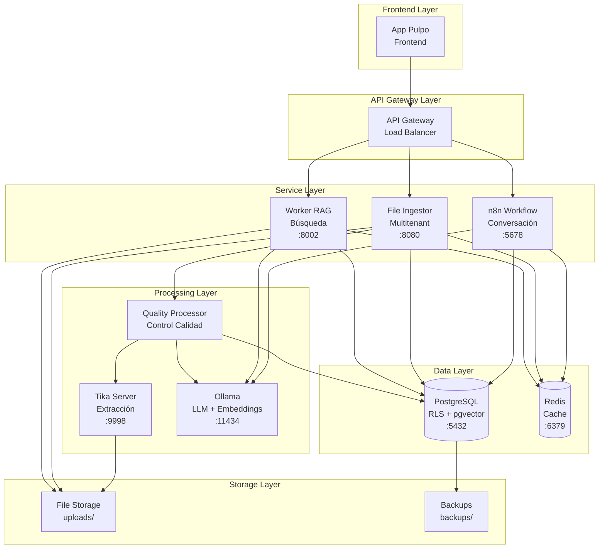
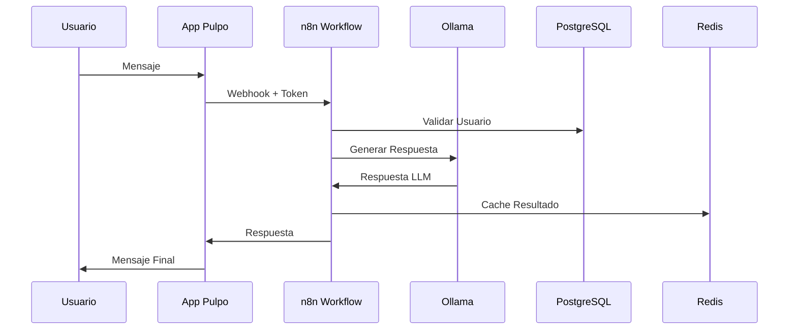
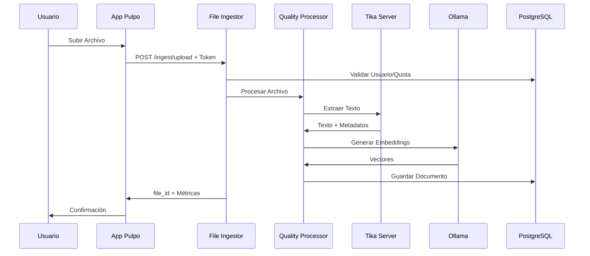
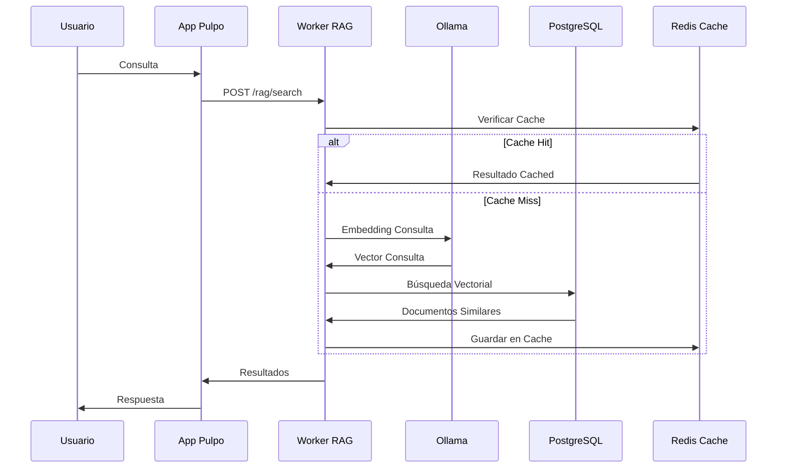
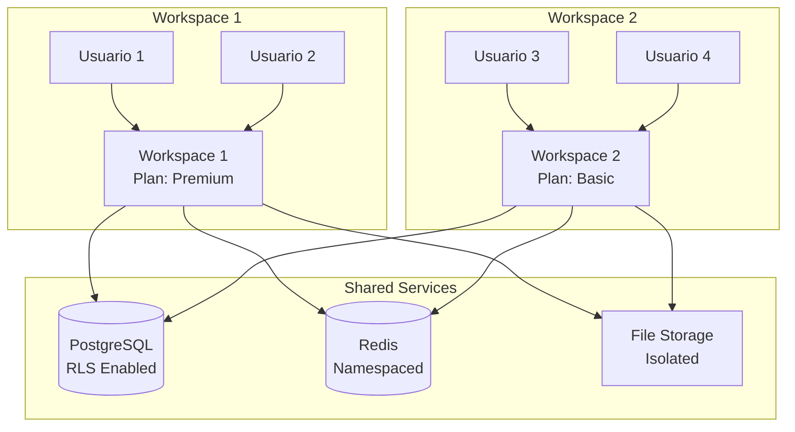
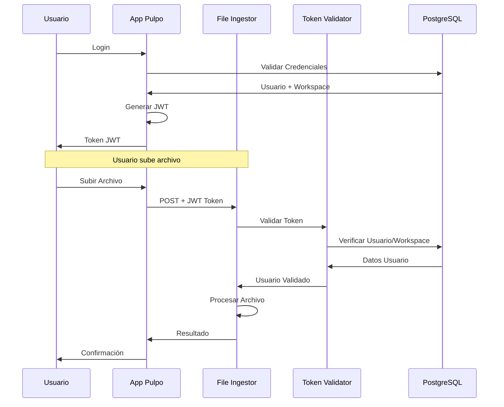
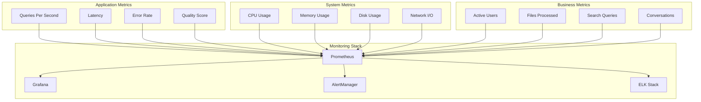
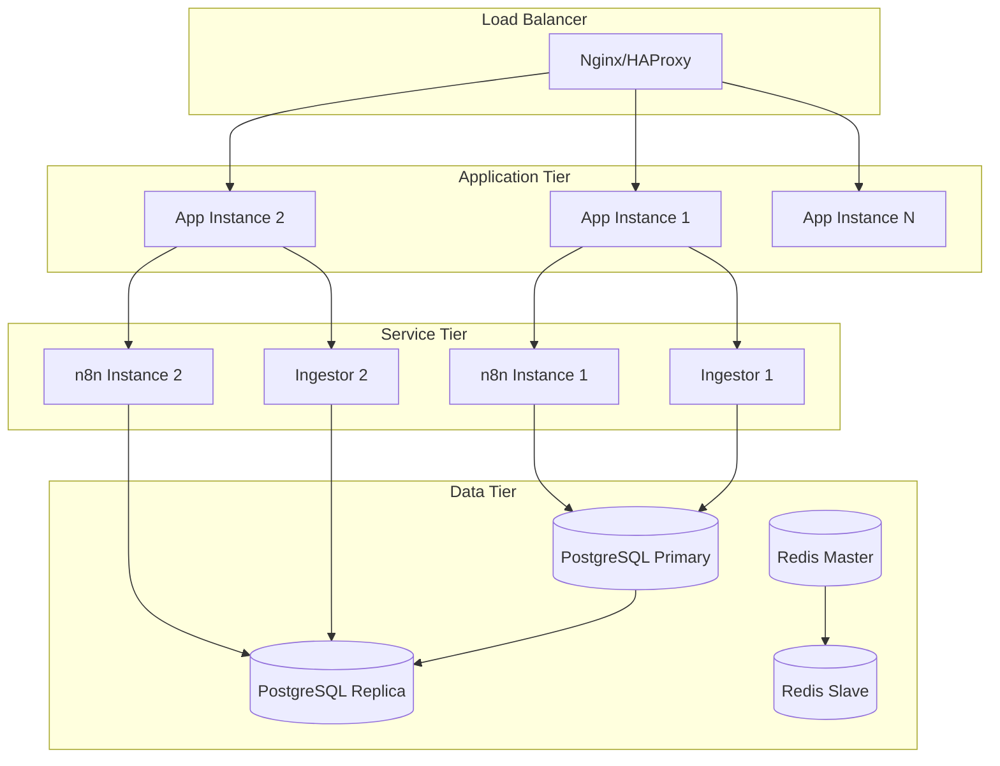

# 🏗️ Diagrama de Arquitectura del Sistema PulpoAI

## 📊 **Vista General del Sistema**

## 🔄 **Flujo de Datos Principal**

## 📁 **Flujo de Ingesta de Archivos**

## 🔍 **Flujo de Búsqueda RAG**

## 🏢 **Arquitectura Multi-Tenant**

## 🔐 **Flujo de Autenticación**

## 📊 **Métricas y Monitoreo**

## 🚀 **Despliegue y Escalabilidad**

## 🔧 **Componentes por Capa**

### **Frontend Layer**
- **App Pulpo**: Interfaz de usuario principal
- **Responsabilidades**: UI/UX, autenticación, gestión de archivos

### **API Gateway Layer**
- **Load Balancer**: Distribución de carga
- **Responsabilidades**: Routing, rate limiting, SSL termination

### **Service Layer**
- **n8n Workflow**: Orquestación de conversaciones
- **File Ingestor**: Procesamiento de archivos multitenant
- **Worker RAG**: Búsqueda semántica

### **Processing Layer**
- **Tika Server**: Extracción de texto
- **Ollama**: LLM y embeddings
- **Quality Processor**: Control de calidad

### **Data Layer**
- **PostgreSQL**: Base de datos principal con RLS
- **Redis**: Cache y sesiones

### **Storage Layer**
- **File Storage**: Archivos subidos
- **Backups**: Respaldo de datos

## 📈 **Métricas de Rendimiento**

| Componente | QPS | Latencia | Disponibilidad |
|------------|-----|----------|----------------|
| **n8n Workflow** | 100 | 2s | 99.9% |
| **File Ingestor** | 50 | 5s | 99.5% |
| **Worker RAG** | 200 | 500ms | 99.9% |
| **PostgreSQL** | 1000 | 10ms | 99.99% |
| **Redis** | 10000 | 1ms | 99.99% |

## 🎯 **Puntos de Integración**

1. **App Pulpo ↔ n8n**: Webhooks para conversación
2. **App Pulpo ↔ File Ingestor**: API REST para archivos
3. **n8n ↔ Worker RAG**: Búsqueda semántica
4. **File Ingestor ↔ Worker RAG**: Sincronización de datos
5. **Todos ↔ PostgreSQL**: Persistencia de datos
6. **Todos ↔ Redis**: Cache compartido

---

**Nota**: Este diagrama representa la arquitectura actual del sistema PulpoAI v2.0, mostrando las interacciones entre componentes y los flujos de datos principales.

