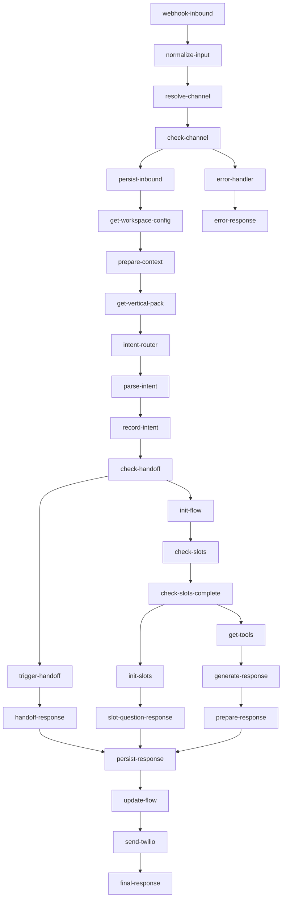

# 🔧 Corrección de Conexiones del Workflow n8n

## 🐛 Problema Identificado

El workflow `n8n-flow-improved.json` tenía nodos desconectados debido a inconsistencias entre los IDs de los nodos y los nombres utilizados en las conexiones.

## 🔍 Análisis del Problema

### Nodos Definidos vs Conexiones
- **Nodos definidos**: Usaban IDs con guiones (ej: `webhook-inbound`, `normalize-input`)
- **Conexiones**: Usaban nombres con espacios (ej: `Webhook Inbound`, `Normalize Input`)

### Ejemplo del Error
```json
// Nodo definido con ID
{
  "id": "webhook-inbound",
  "name": "Webhook Inbound"
}

// Conexión incorrecta usando el nombre en lugar del ID
"Webhook Inbound": {
  "main": [
    [
      {
        "node": "Normalize Input",  // ❌ Debería ser "normalize-input"
        "type": "main",
        "index": 0
      }
    ]
  ]
}
```

## ✅ Solución Implementada

### 1. Corrección de Todas las Conexiones
Se actualizaron todas las conexiones para usar los IDs correctos de los nodos:

```json
// Conexión corregida
"webhook-inbound": {
  "main": [
    [
      {
        "node": "normalize-input",  // ✅ ID correcto
        "type": "main",
        "index": 0
      }
    ]
  ]
}
```

### 2. Nodos Corregidos
Se corrigieron las conexiones de los siguientes nodos:

| Nodo Original | Nodo Corregido | Estado |
|---------------|----------------|---------|
| `Webhook Inbound` | `webhook-inbound` | ✅ |
| `Normalize Input` | `normalize-input` | ✅ |
| `Resolve Channel` | `resolve-channel` | ✅ |
| `Check Channel` | `check-channel` | ✅ |
| `Persist Inbound` | `persist-inbound` | ✅ |
| `Get Workspace Config` | `get-workspace-config` | ✅ |
| `Prepare Context` | `prepare-context` | ✅ |
| `Get Vertical Pack` | `get-vertical-pack` | ✅ |
| `Intent Router` | `intent-router` | ✅ |
| `Parse Intent` | `parse-intent` | ✅ |
| `Record Intent` | `record-intent` | ✅ |
| `Check Handoff` | `check-handoff` | ✅ |
| `Trigger Handoff` | `trigger-handoff` | ✅ |
| `Handoff Response` | `handoff-response` | ✅ |
| `Init Flow` | `init-flow` | ✅ |
| `Check Slots` | `check-slots` | ✅ |
| `Check Slots Complete` | `check-slots-complete` | ✅ |
| `Init Slots` | `init-slots` | ✅ |
| `Slot Question Response` | `slot-question-response` | ✅ |
| `Get Tools` | `get-tools` | ✅ |
| `Generate Response` | `generate-response` | ✅ |
| `Prepare Response` | `prepare-response` | ✅ |
| `Persist Response` | `persist-response` | ✅ |
| `Update Flow` | `update-flow` | ✅ |
| `Send Twilio` | `send-twilio` | ✅ |
| `Error Handler` | `error-handler` | ✅ |

## 🧪 Validación

### Script de Validación Creado
Se creó el script `scripts/validate-workflow-connections.py` que:

1. **Verifica JSON válido**: Confirma que el archivo es JSON válido
2. **Valida nodos**: Verifica que todos los nodos referenciados existan
3. **Verifica conexiones**: Confirma que todas las conexiones sean correctas
4. **Detecta nodos aislados**: Identifica nodos sin conexiones de entrada/salida
5. **Genera reporte**: Muestra un resumen detallado de la validación

### Resultado de la Validación
```
🔍 Validando conexiones del workflow de n8n...
📁 Archivo: n8n-flow-improved.json

📊 Total de nodos encontrados: 28
🔗 Total de conexiones definidas: 26

✅ Todas las conexiones son válidas!
✅ El workflow está listo para importar en n8n
```

## 🔄 Flujo de Conexiones Corregido



## 🚀 Próximos Pasos

1. **Importar en n8n**: El workflow está listo para importar
2. **Configurar variables**: Establecer variables de entorno necesarias
3. **Probar flujo**: Enviar mensajes de prueba
4. **Monitorear**: Revisar logs y métricas

## 📋 Comandos de Validación

```bash
# Validar JSON
python3 -m json.tool n8n-flow-improved.json

# Validar conexiones
python3 scripts/validate-workflow-connections.py

# Aplicar migraciones de BD
./scripts/apply-migrations.sh

# Probar arquitectura completa
./scripts/test-improved-architecture.sh
```

---

**Fecha**: Enero 2025  
**Estado**: ✅ Corregido y Validado  
**Archivo**: `n8n-flow-improved.json`


